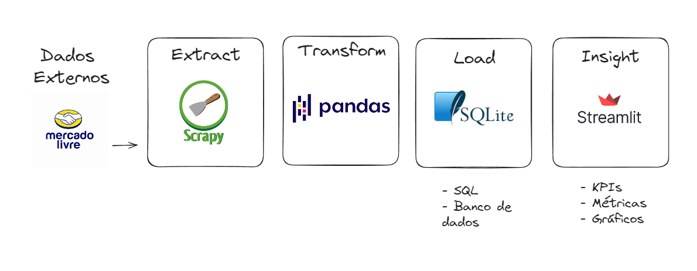

## ETL em python para monitoramento de preços

Solução de uma ETL em pPython que coleta, consolida e gera insights sobre estratégias de pricing.

## Arquitetura

* Extração - Scrapy
* Transformação e Load - Pandas
* Dashboard - Streamlit
* Banco de dados - SQLite3

## Diagrama

Fonte: [Workshop aberto scraping](https://github.com/lvgalvao/projetoscrapingaovivo)
